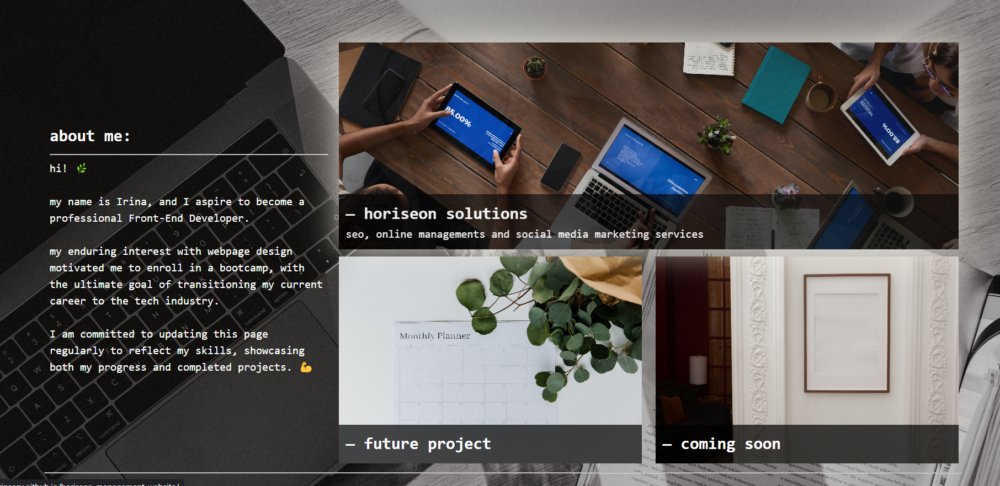

# portfolio-page

## Introduction

  :tea:  

This page serves as a portfolio, intended to showcase my skills and deployed projects.

Portfolio website will undergo frequent updates to ensure it reflects the latest projects. 

## Installation

**N/A**, unless downloaded from repository and used for experiments :alien:

## Usage

Navigate to **irinascv** [Portfolio Page](https://irinascv.github.io/portfolio-page/)  

Click on **work** section and review up-to-date projects.

To review HTML  
and CSS code used for this page, right click and select ***"Inspect"*** :ghost:

This portfolio has CSS @media queries element - check it out on your phone or tablet to see how it changes :iphone:

## Credits :wave:

- **edX** bootcamp :stars:
- [W3 School](https://www.w3schools.com/css) for all sorts of CSS features explained
- [GitHub](https://github.com/GnuriaN/format-README/blob/master/emoji.md) for *emojis*
- :camera: **pictures all by:**
- [Kaboompic](https://kaboompics.com/gallery/photos/category/business-office?search=&page=7) - *background photo*
- [Monstera Production](https://www.pexels.com/photo/empty-white-frame-hanging-on-wall-with-patterns-6373517/) - *from Pexels - coming soon photo*
- [fauxels](https://www.pexels.com/photo/people-having-business-meeting-together-3183183/) - *from Pexels - "horiseon solutions" office photo*
- [PNW Production](https://www.pexels.com/photo/a-planner-over-a-white-table-8251148/) - *from Pexels - future project photo*
- [CSS Media Queries for Beginners](https://www.youtube.com/watch?v=P_vkS4UJNDk&ab_channel=CemEygiMedia) - *youtube video for media queries tutorial*